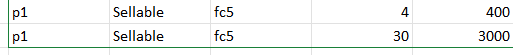

# Тестовое задание от PropVue LLC
Задание выполнено на стеке: Java 17, Spring (Boot, Web, Data), Gradle(Kotlin), 
Postgres, Liquibase, JUnit 5, Lombok, Mapstruct, Swagger.

Приложение, а также БД для него помещены в докер, запуск осуществляется через docker-compose. 
Слой данных реализован через Spring Data JPA, один компонент через Criteria API. 
Документация сгенерирована при помощи OpenAPI/Swagger. Миграции Liquibase.

## Запуск проекта
Выполнить в терминале следующие команды:
1) `./gradlew bootJar`  
2) `docker-compose up` 
### Доступные эндпоинты описаны в документации swagger:
http://localhost:8080/swagger-ui/index.html

#### При запуске через среду разработки добавить переменные среды: 
`DB_HOST=localhost;DB_PORT=5432;DB_NAME=propvue;POSTGRES_USER=user;POSTGRES_PASSWORD=password`

_P.S. Чувствительные данные умышленно добавлены в репозиторий_

## Ход мыслей: 
___
### По условию:
Некоторые моменты из ТЗ какие-то совсем странные:
> Для выполнения задания 1, пожалуйста, сделайте копию исходных данных для 
> парсинга по ссылке из Гугл таблиц и настройте доступ для редактирования по ссылке, для последующей проверки.  

Что надо сделать? Первая мысль - интегрироваться с гугл таблицами, настроить парсинг данных как отдельный компонент приложения.  
Но при дальнейшем прочтении задания эта мысль отпадает. Видимо это просто тестовые 
данные, которые нужно поместить в БД. Но зачем копировать таблицу и открывать доступ для редактирования?) Не понимаю.

> Дано: таблица содержит следующие данные:
> - Product: Идентификатор продукта (например, p1, p2).
> ...

Идентификатор... хорошо. Смотрим данные - идентификаторы повторяются? Значит это всё-таки не идентификатор?)
Тогда получается это внешний ключ? а значит пара статус + центр выполнения должны быть уникальны  
Но и тут я нашел дубликат...  
  
В общем, я не понял как должна выглядеть моя сущность.

Также, изначально я почему-то решил, что стоимость это цена, поэтому в бизнес-логике заложил умножение при подсчете общего значения.  
Переделывать бизнес-логику не стал, тк на мой взгляд лучше хранить количество + цену, чем количество + стоимость.

___

### По написанию кода:
Сначала определил как должна выглядеть сущность. "Значение" судя по всему денежный тип, 
но это не точно, чтоб наверняка решил использовать универсальный вариант - decimal(10, 2).
Написал миграции.  

Сразу сделал докер-компоуз, тк в дальнейшем буду складывать приложение в контейнер, а пока что можно 
удобно запустить БД.

Затем притупил к основному функционалу. Написал контроллер, сервис, репозиторий.  
Пункты 2.2. и 5.1. из ТЗ объединил в одном эндпоинте, принимающем 2 необязательных параметра, 
которые можно комбинировать. Так логика получается более гибкой. Для реализации использовал Criteria API 
(из-за необязательности параметров).

Протестировал через постман ручками.  

Подключил сваггер, написал тесты, написал обработчик исключений, запаковал в контейнер. Готово.

В конце заметил, что тестовые данные не ложатся на мою сущность, 
но исходя из этих данных я так и не понял как она должна выглядеть, 
немного подкорректировал сущность (добавил имя, переименовал "значение") и тестовые данные (заменил стоимость на цену, чтобы у вас 
при проверке всё подбивалось).

По-хорошему можно было бы еще много функционала допилить - операции с именем, 
интеграционные тесты, кэширование и т.п., но тк я не уверен, что вас вообще устроит то как я поступил 
с сущностью, решил много времени не тратить).

